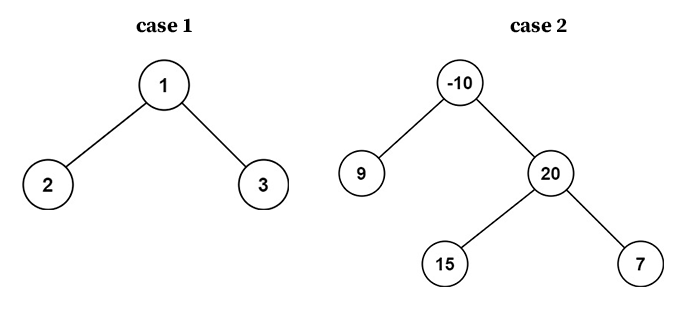

### Binary Tree Maximum Path Sum
**Recursion**
- Concepts
    - Case1: Create a maximum total sum including the parent node 
    - Case2: Create a maximum total sum excluding the parent node 
    
- [Source code](source/Recursion.py)
```python
# Definition for a binary tree node.
# class TreeNode:
#     def __init__(self, val=0, left=None, right=None):
#         self.val = val
#         self.left = left
#         self.right = right
class Solution:
    def maxPathSum(self, root: TreeNode) -> int:
        def max_gain(node):
            # return 0 if it reached the leaf
            # get the maximum sum from the left and right node
            # get the total sum of the path that excludes the parent node
            # discard the parent node path if the total sum is higher
            # returning and building up a path that creates the total sum with the parent node
            pass

        # set a global variable to keep track of the maximum sum
        # run the recursion
        # return the maximum sum
        pass
```