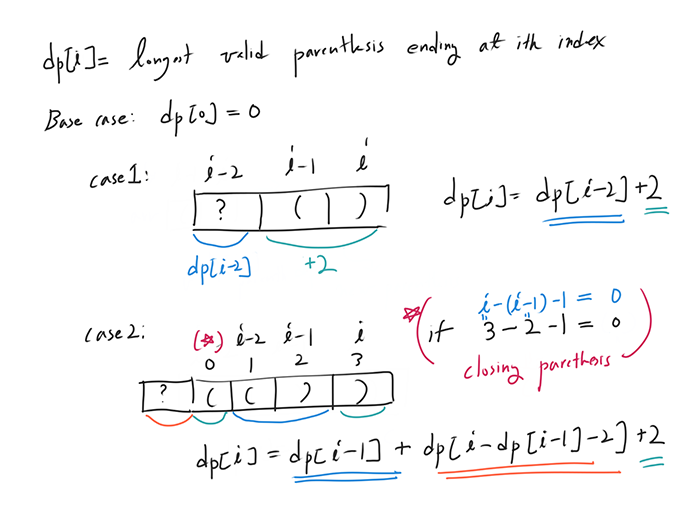

### Longest Valid Parentheses
**Using Dynamic Programming**
- [Concepts](images/)

    
- [Source code](source/)
- [Reference #1]()

**Using Stack**
- [Concepts](images/)
- [Source code](source/)
- [Reference #1]()

**Without extra space**
- [Concepts](images/)
- [Source code](source/)
- [Reference #1]()