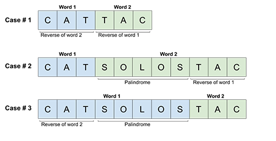

### Palindrome Pairs
**Hashmap**
- [Concepts](images/)
    - Case1: A palindrome pair is formed by 2 words that are the reverse of each other.
    - Case2: The first word is shorter than the second word. 
        - The second word starts with a palindrome, and ends with the reverse of the first word.
    - Case3: The first word is longer than the second word.
        - The first word ends with a palindrome, and starts with the reverse of the second word.
       
    
- [Source code](source/Hashmap.py)
```python
class Solution:
    def all_valid_prefixes(self, word):
        # set the array to collect substrings that can be compared with word2
        # iterate the word1
            # if there are palindrome within the rightside of word1
                # return the lefovers that can be compared with word2
        pass

    def all_valid_suffixes(self, word):
        # set the array to collect available substrings that can be compared with word1
        # iterate the word2
            # if there are palindrome within the leftside of word2
                # return the leftovers that can be compared with word1
        # return the availble substrings
        pass

    def palindromePairs(self, words):
        # set the hashmap that stores the indexes of each word
        # set the array to store the possible pairs
        # iterate the input
            # get the reversed word
            # case #1
            # case #2
            # case #3
        # return the available pairs
        pass
```

**Trie**
- [Source code](source/Trie.py)
```python
class TrieNode:
    def __init__(self):
        # set the pointer to the next level
        # set the indicator that the current level is a finished word
        # set the indicator that the current level is a palindrome
        pass

class Solution:
    def palindromePairs(self, words):
        # Create the Trie
        # add the reversed nodes in the Trie
                # Label the the remainder if they are a palindrome.
            # mark the current level with the current word

        # Look up each word in the Trie and find palindrome pairs.
            # case 3: if word1 is longer than word2
                # if a matching word is found in the current level
                    # check the right side of word1 is a palindrome
                        # add as a solution
                # break if no matching word is found
                # go down to the deeper level of Trie
            # if case 3 is not applied after iterating teh whole word
                # case 1: a palindrome is found
                # case 2: if word2 is longer than word1 and word2 consists a palindrome
        # return the palindrome pairs
        pass
```
