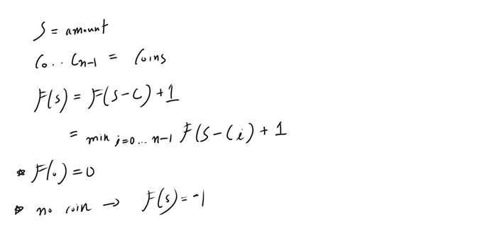

### Coin Change
**Top down**
- Concept
    - Provide an optimal substructure property
    
- [Source code](source/Topdown.py)
```python
class Solution:
    def coinChange(self, coins: List[int], amount: int) -> int:
        # create the cache to record the results
        # invoke the recursion
        pass

    def topdown(self, coins, remain):
        # return false if there is no matching accumulation of coins
        # return zero if all the coins matched the amount
        # return the recorded result if the answer is already explored
        # set the min variable to get the minimum collection of coins to match the amount
        # iterate the coins
            # get the number of possible coins from the recursion
            # Update the min value if the result is valid (note that need to + 1 for the final result)
        # record -1 if the min is invalid
        # record the min if the min is valid
        # return the number of coins that are required to match the amount
        pass
```

**Bottom up**
- [Concepts](images/Bottomup.png)
- [Source code](source/Bottomup.py)
```python
class Solution:
    def coinChange(self, coins: List[int], amount: int) -> int:
        # set the array to record the results of each amount
        # if total amount is zero there is zero coins
        # iterate the amount by one
            # iterate through the coins
                # if the coins can fit with the amount
                    # update the answer by adding or without the coins
        # return the minimum number of coins or -1 if invalid
        pass
```