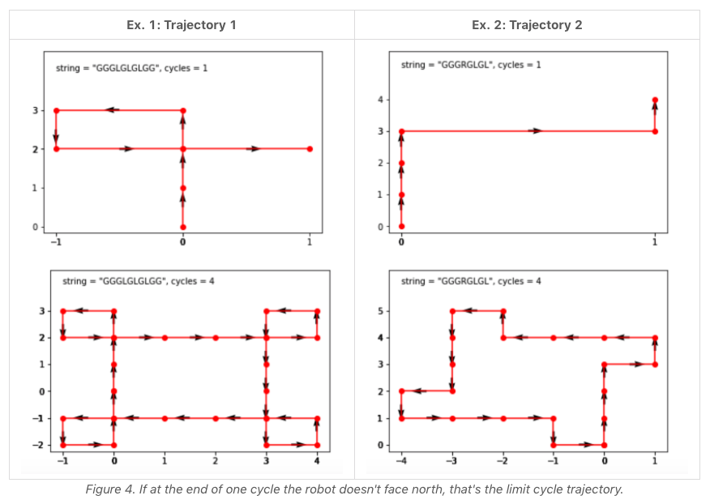

### Robot Bounded In Circle
**limit cycle trajectory**
- Concepts
    - the limit cycle trajectory
        - After at most 4 cycles, the limit cycle trajectory returns to the initial point. 
        1. If the robot returns to the initial point after one cycle, that's the limit cycle trajectory.
        2. If the robot doesn't face north at the end of the first cycle, that's the limit cycle trajectory.



- [Source code](source/Limit.py)
```python
class Solution:
    def isRobotBounded(self, instructions: str) -> bool:
        # north = 0, east = 1, south = 2, west = 3
        # set a index for the directions
        # initial position is in the center
        # iterate the instructions
            # go west if moving to the left
            # go east if moving to the right
            # increase x,y if moving straight
        # return true if the robot returns into initial position or the robot doesn't face north
        pass
```